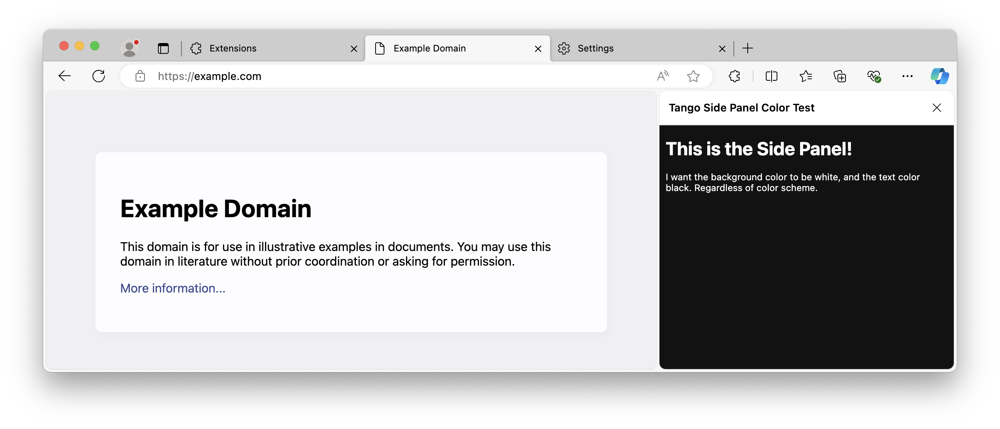
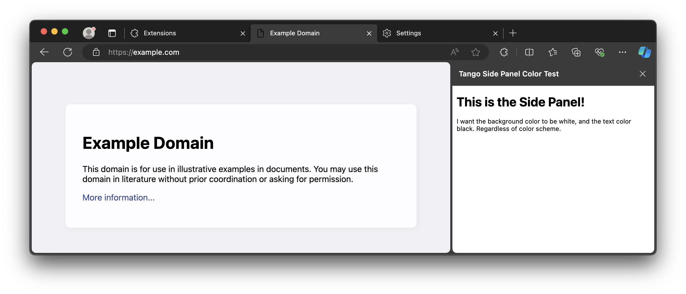

# Microsoft Edge Side Panel Color Bug 

The Side Panel in Microsoft Edge (`chrome.sidePanel`) uses an incorrect background color and text color, at least on macOS.

I want a side panel with a white background and black text color regardless of color scheme, but that seems impossible.
It seems that the `color-scheme` setting is ignored.

To reproduce:

1. clone this repository (the code is super short so check it!)
2. go to `edge://extensions` and load an unpacked extension, select this folder
3. go to `edge://settings/?search=dark` and select _Light_
4. now go to the extensions menu and open this extension as a side panel

You'll now see that the side panel gets a dark background, but the browser UI is light:

Now when you switch to Dark in `edge://settings`, it reverts to this:

It seemingly inverses the dark and light scheme. I don't really care about that, but I just want a way to enforce the light scheme in my extension. Edge overrides the background and text colors, even when I explicitly set `body { background: #fff }`.